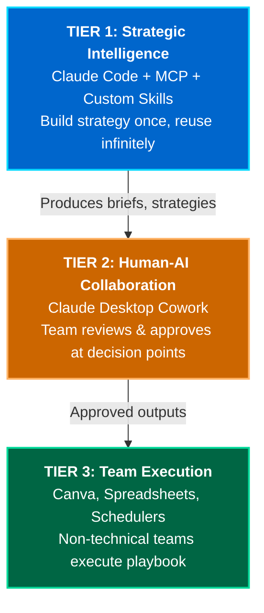
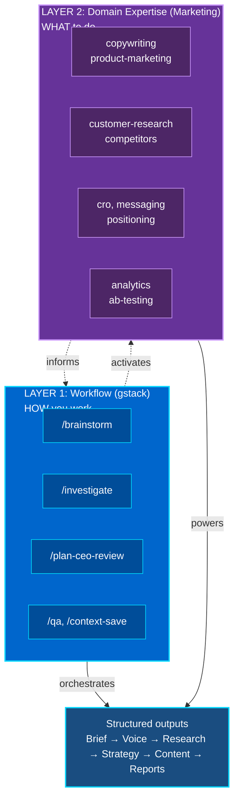
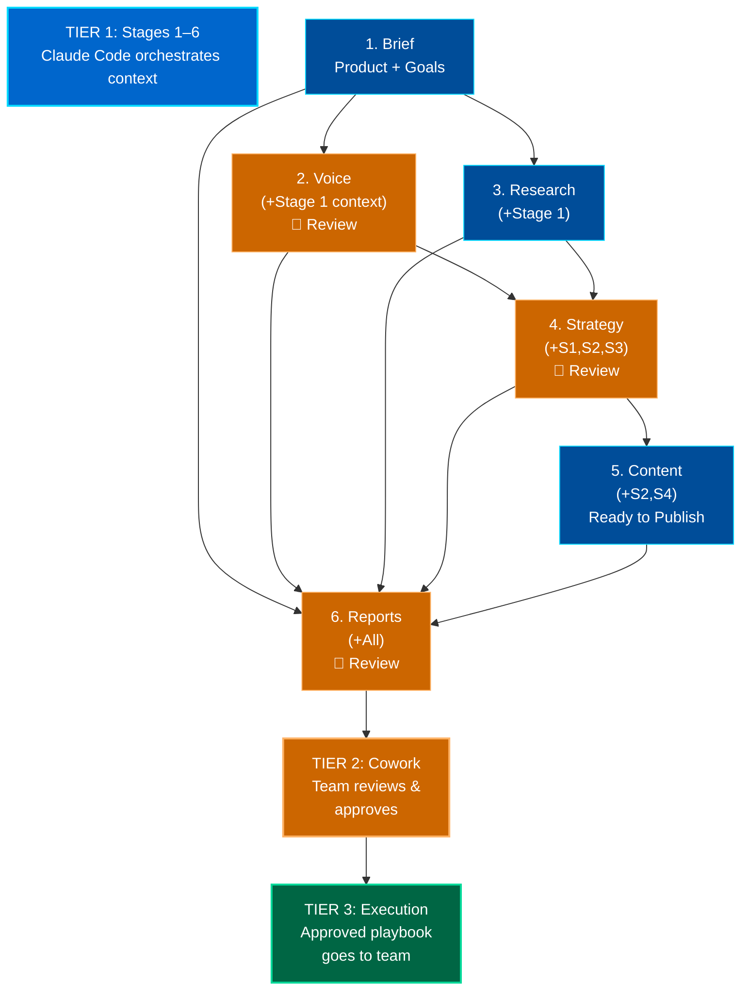

# Marketing OS: AI-Powered Marketing Operations System

**Portfolio Case Study: For Companies Building In-House AI Operations**

A production-ready marketing automation system designed to help teams operate independently without external agencies. This case study demonstrates:
- How to architect multi-stage AI workflows with context preservation
- Scalable, division-agnostic system design that extends beyond marketing
- Rapid team onboarding and autonomous operation
- Measurable business impact (time, cost, team capacity)

The same three-tier architecture extends to any division: HR Recruiting, Legal Compliance, Finance Forecasting, Product Launches, Sales Operations.

**Quick Navigation:**
1. [The Problem](#the-problem)
2. [What This System Enables](#what-this-system-enables)
3. [Three-Tier Architecture](#the-three-tier-architecture)
4. [How This System Is Built](#how-this-system-is-built)
5. [System Architecture](#system-architecture-how-context-preservation-works)
6. [The 6-Stage Workflow](#the-6-stage-workflow)
7. [Skills Architecture](#skills-architecture-two-layers-powering-tier-1)
8. [How It Works](#how-it-works-workflow-as-context-across-three-tiers)
9. [Why This Works](#why-this-works-three-tier-separation--context-preservation)
10. [Explore the System](#explore-the-system)
11. [Business Outcomes](#business-outcomes-day-1-to-month-1)
12. [Deliverables](#deliverables-per-campaign)
13. [FAQ](#faq)

---

## The Problem

Most organizations face the same marketing execution bottleneck:

- **Current state:** Teams use AI tools (ChatGPT, Claude, Gemini, DeepSeek, Grok) as chat interfaces. Copy-paste prompts into separate conversations. Context is lost between stages.
- **The cost:** Either outsource to agencies (expensive: $3-5K per campaign, slow: 3-5 days) or build internally (expensive: $300K+ dev cost, slow: 2-3 months to launch)
- **The gap:** No system exists that combines AI speed with in-house control. Teams remain dependent on external agencies or face massive engineering timelines.

This system bridges that gap by enabling teams to operate independently.

## What This System Enables

**Speed & Efficiency:**
- System setup: 15 minutes
- First campaign launch: 1-2 hours of focused work
- Subsequent campaigns: 30-45 minutes (with templates reuse)
- Compare: Traditional agencies take 3-5 days per campaign

**Complete Strategic Control:**
- Your team makes all strategic decisions. No external agency gatekeeping.
- Owns brand voice, messaging, and platform choices throughout the workflow.
- Clear approval trail through Claude Desktop Cowork keeps decisions transparent.
- No vendor lock-in for your proprietary strategy, data, or team knowledge.
- Ship independently from Day 1 with no external approval bottlenecks.

**Financial Impact:**
- Removes $3-5K per campaign in agency fees
- Eliminates 2-3 months of engineering timeline
- First campaign ROI is immediate
- Subsequent campaigns approach zero marginal cost
- Typical payback: first 3-4 campaigns

---

## The Three-Tier Architecture



**Why three tiers matter:**
- **Tier 1 scales:** Build strategy once, reuse infinitely. Strategist effort doesn't increase with scale.
- **Tier 2 keeps humans in control:** Every major decision (Stages 2, 4, 6) goes through Claude Desktop Cowork where team members approve outputs before execution
- **Tier 3 stays simple:** Non-technical team members execute using straightforward tools, following an approved playbook

**Learn more:** [docs/showcase/architecture-overview/00-three-tier-stack.md](docs/showcase/architecture-overview/00-three-tier-stack.md) for visual diagrams and detailed breakdown.

---

## How This System Is Built

Traditional agencies charge $5K-$10K for brand guidelines. This system builds brand consistency into the core, making it reusable and cost-free through Tier 1 and Tier 2.

**How it works:**
- **Brand definition (5 minutes):** Personas, tone, messaging pillars, sample phrases are captured once in Stage 2 (Brand Voice)
- **Systematic reuse:** Every strategy and content piece inherits the brand voice automatically (Stage 4 Strategy and Stage 5 Content both reference Stage 2)
- **Team approval:** Brand voice is refined in Claude Desktop Cowork before content generation (Tier 2 approval gate at Stage 2)
- **Cross-platform consistency:** All 6 platforms (Facebook, Instagram, TikTok, LinkedIn, X, Threads) sound like the same brand without manual effort
- **Team ownership:** No external agency gatekeeping. Your team controls brand evolution through approval gates.
- **Knowledge transfer:** New hires onboard to documented systems, not tribal knowledge. Brand logic is codified and accessible.

This transforms brand consistency from a one-time expense into a living, scalable asset owned by your team.

---

## System Architecture: How Context Preservation Works

Most teams lose context between conversations. This system preserves it by using AI agents that work together intelligently across all stages of a campaign.

**Core design principles:**
- **Tier 1 orchestration:** 84 AI agents (from gstack + marketing skills) work in tandem, not isolated chat prompts
- **Context flows across all 6 stages (Tier 1):** Stage 5 content generation inherits Stage 2's brand voice and Stage 4's strategy automatically
- **Human oversight at key stages (Tier 2):** Approval gates at Stages 2, 4, 6 in Claude Desktop Cowork ensure team stays in control
- **Execution separation (Tier 3):** No context switching required — execution team uses approved outputs with simple tools
- **Division-agnostic foundation:** Same architecture works for marketing, HR recruiting, legal compliance, finance forecasting

**Key insight:** AI agents are most powerful when they share context and specialize by function. Combined with human approval gates (Tier 2), this prevents the "black-box AI" problem.

---

## The 6-Stage Workflow


**40 minutes end-to-end** (Tier 1: Claude Code) + approval time in Claude Desktop Cowork (Tier 2) + execution (Tier 3)

<details>
<summary><b>Detailed stage breakdown</b> (timing, inputs, outputs)</summary>

| Stage | Time | What Gets Produced | Tier 2 Review |
|-------|------|-------------------|---------------|
| **1. Brief** | 5m | 500-word strategic direction + audience persona | — |
| **2. Voice** | 5m | Tone, persona, voice rules | ✅ Team refines in Cowork |
| **3. Research** | 10m | TAM/SAM/SOM, competitors, trends | — |
| **4. Strategy** | 5m | Positioning, messaging hierarchy, channels | ✅ Team validates in Cowork |
| **5. Content** | 10m | 6 platform-specific drafts (ready to publish) | — |
| **6. Reports** | 5m | Reach, engagement, conversion, ROI forecasts | ✅ Team reviews in Cowork |

</details>

**Comparison:** Traditional agencies require 3-5 days per campaign. In-house engineering build requires 2-3 months.

---

## What are Skills?

Skills are markdown files that teach AI agents how to do specific tasks well — think of them as recipes with best practices, frameworks, and decision logic built in.

<details>
<summary><b>How skills work</b> (why this architecture matters)</summary>

- **Specialized knowledge**: Each skill encodes domain expertise (copywriting, SEO, CRO, sales, etc.)
- **Context & guidance**: Skills give agents the reasoning they'd need otherwise — what questions to ask, what tradeoffs matter, what outcomes to optimize for
- **Consistency**: Best practices are defined once, applied automatically across all campaigns
- **Cross-skill intelligence**: Skills reference each other. When copywriting and CRO skills work together, the system understands how messaging affects conversions
- **Without skills**: Copy-paste prompts, lost context, no institutional knowledge
- **With skills**: AI agents become domain partners who enforce your standards automatically

</details>

---

## Skills Architecture: Two Layers Powering Tier 1

Tier 1 uses two distinct skill layers working together:



**Layer 1 (gstack)**: Orchestration, context preservation, quality gates  
**Layer 2 (Marketing)**: 40+ specialized skills across copywriting, SEO, ads, growth, sales, analytics  

**See all skills:** [docs/skills.md](docs/skills.md)

<details>
<summary><b>How layers work together at each stage</b></summary>

| Stage | Workflow | Domain Expertise | Purpose |
|-------|----------|------------------|---------|
| 1. Brief | `/brainstorm` | product-marketing | What you're building & who you're selling to |
| 2. Voice | `/brainstorm` | copywriting, product-marketing | Brand voice and messaging rules |
| 3. Research | `/investigate` | customer-research, competitors | Market, audience, competition |
| 4. Strategy | `/plan-ceo-review` | cro, product-marketing | Positioning and messaging |
| 5. Content | Native Claude | copywriting, ad-creative | Platform-specific drafts |
| 6. Reports | `/qa` | analytics, ab-testing | Quality and ROI impact |

**The interaction flow:**
1. gstack skill initiates the stage
2. Relevant marketing skills activate based on context
3. Output includes reasoning from all applicable skills
4. Quality gates verify against brand standards
5. If needed, restore previous work and refine

</details>

---

## How It Works: Workflow-as-Context Across Three Tiers

Context preservation is the difference between AI tools and AI systems.



**The flow:** 
- **Within Tier 1:** Each stage inherits context from all previous stages. Stage 5 content knows the voice (Stage 2) and strategy (Stage 4) automatically.
- **Tier 1 → Tier 2:** Outputs flow into Claude Desktop Cowork for team review at decision points.
- **Tier 2 → Tier 3:** Approved outputs become the execution playbook.

<details>
<summary><b>Context inheritance details by stage</b></summary>

| Stage | Inputs | Purpose | Output Goes To |
|-------|--------|---------|----------------|
| 1. Brief | Product, goals | Strategic direction | Stages 2, 3, 4, 6 |
| 2. Voice | Brief | Brand tone + rules | Stages 4, 5, 6 (team review) |
| 3. Research | Brief | Market intelligence | Stages 4, 6 |
| 4. Strategy | Brief + Voice + Research | Positioning + channels | Stages 5, 6 (team review) |
| 5. Content | Voice + Strategy | Platform-specific copy | Stage 6, publishing |
| 6. Reports | All stages | Performance & ROI | Team, board (team review) |

</details>

---

## Why This Works: Three-Tier Separation + Context Preservation

**Tier 1 advantage: Context Preservation**
  - Context automatically flows across all 6 stages (not 6 isolated chats)
  - Stage 5 (Content) inherits Brand Voice (Stage 2) + Strategy (Stage 4) without manual re-entry
  - Each `/command` builds directly on previous output
  - No manual context switching or copy-paste friction
  - This is why Tier 1 execution time is 40 minutes instead of 5-7 days

**Tier 2 advantage: Human-AI Collaboration at Decision Points**
  - Tier 1 produces outputs, but humans approve them in Claude Desktop Cowork
  - Approval gates at Stages 2 (Voice), 4 (Strategy), 6 (Reports) prevent misalignment before Tier 3 execution
  - Non-technical team members can refine outputs directly in Cowork (no technical skills required)
  - Clear governance trail: what was approved, when, and by whom

**Tier 3 advantage: Execution Simplicity**
  - Once Tier 2 approves, Tier 3 execution is plug-and-play
  - Non-technical team members use simple tools (Canva, spreadsheets, schedulers)
  - No need to understand strategy, AI, or the system itself — just follow the approved playbook
  - Scales cheaply: 1 strategist, 100+ executors

**How this differs from traditional AI usage:**
  - Traditional: Copy-paste prompts into ChatGPT, Claude, Gemini per stage, lose context, restart
  - This system: Context preserved automatically across 6 stages, humans approve before execution, non-experts can operate

**Scalability principle: Structure Once, Reuse Infinitely**
  - Most teams: Repeat instructions across conversations for every campaign
  - This system: Define workflow once, deploy infinitely across teams and campaigns
  - Same team member can lead any campaign (system carries the institutional knowledge)
  - New hires ship independently on Day 1 (system teaches the workflow)
  - Tier 1 effort stays constant; Tier 2 and 3 scale horizontally with team size

**Works across any division:**
The same three-tier pattern (strategic thinking → team approval → execution) extends beyond marketing:
  - **Finance:** Budget planning, cash flow forecasting, financial reporting
  - **Legal:** Compliance briefs, contract reviews, legal documentation workflows
  - **Sales:** Outreach sequences, proposal generation, deal qualification
  - **HR:** Recruiting campaigns, onboarding workflows, retention strategies
  - **Product:** Launch planning, feature communication, roadmap alignment

The architecture is domain-agnostic. Only the skill sets change.

---

## Explore the System

**Complete system documentation with real-world examples:**

**Getting started:**
```bash
git clone https://github.com/shireen168/marketing-os.git
cd marketing-os
```

### Quick Links

**👉 Start here: [Complete Showcase](docs/showcase/README.md)**
Full architecture breakdown with real Sunny Homemade example. Shows three-tier system, all 6 stages, and human-AI collaboration in Claude Desktop Cowork.
- **For SMB founders:** See proof it works at your scale (RM1.99 CPA, 255% growth)
- **For Enterprise VPs:** Understand governance, scaling, and approval gates
- **For anyone:** Explore the system through a real business (not abstract theory)

**Documentation:**
1. **[docs/setup.md](docs/setup.md):** Installation and configuration (15 minutes)
2. **[docs/workflow.md](docs/workflow.md):** Step-by-step guide to each of the 6 stages
3. **[docs/faq.md](docs/faq.md):** Answers to common questions about governance, cost, learning curve
4. **[docs/claude.md](docs/claude.md):** System prompt and skill configuration

**Complete Real-World Example:**
- **[docs/showcase/](docs/showcase/):** Complete three-tier architecture with Sunny Homemade
  - Architecture overview (three-tier system + scaling)
  - All 6 stages with real examples (Brief → Voice → Research → Strategy → Content → Reports)
  - In-house vs outsource breakdown with cost modeling
  - Real metrics: RM1.99 CPA, 50.8% thru-play, 255% growth
  - Approval gates in Claude Desktop Cowork

**What the showcase demonstrates:**
- Complete three-tier architecture (Tier 1: Claude Code, Tier 2: Cowork approval gates, Tier 3: team execution)
- Multi-stage AI workflows with context flowing through all 6 stages
- Human-AI collaboration at decision points (Stages 2, 4, 6 approval gates in Cowork)
- Real-world SMB proof point with measurable business results
- In-house vs outsource trade-offs and scaling patterns
- Rapid deployment approach for team independence (40 min to 100+ campaigns)

---

## Business Outcomes: Day 1 to Month 1

This system is designed to deliver measurable impact immediately:

**Day 1:** System deployed and operational. First campaign launches end-to-end without external agency involvement.

**Week 1:** 3-5 campaigns shipped. Team operates independently. Zero external dependencies or approval bottlenecks.

**Month 1 Impact:**
  - 40+ hours saved compared to agency outsourcing
  - Campaigns ship that would normally be deferred (niche audiences, fast-moving markets, high iteration)
  - $12-20K in averted agency fees
  - Team confidence in independent operation established

**Keys to success:** Full adoption of structured workflows. Emphasis on reusable templates. Quick iteration cycles.

---

## Deliverables Per Campaign

This system produces production-ready assets:

- **Structured Brief:** Audience definition, channel selection, messaging focus
- **Brand Framework:** Tone guidelines, persona definition, voice rules (normally $5K external cost)
- **Market Research:** TAM/SAM/SOM analysis, competitor intelligence, trend analysis
- **Strategic Positioning:** Messaging hierarchy, channel matrix, audience targeting
- **Content Drafts:** 6 platform-specific pieces (Facebook, Instagram, TikTok, LinkedIn, X, Threads) ready to publish
- **ROI Projections:** Reach estimates, engagement forecasts, conversion modeling

All output is publication-ready. No external editing, formatting, or agency review needed.

---

## FAQ

**Quick answers to common questions:**

- Will our team actually use this?
- Is this just a marketing tool?
- What if we already have processes?
- How is this different from hiring an agency?
- Can we customize it?

**See:** [docs/faq.md](docs/faq.md) for full answers.

---

## License

MIT
