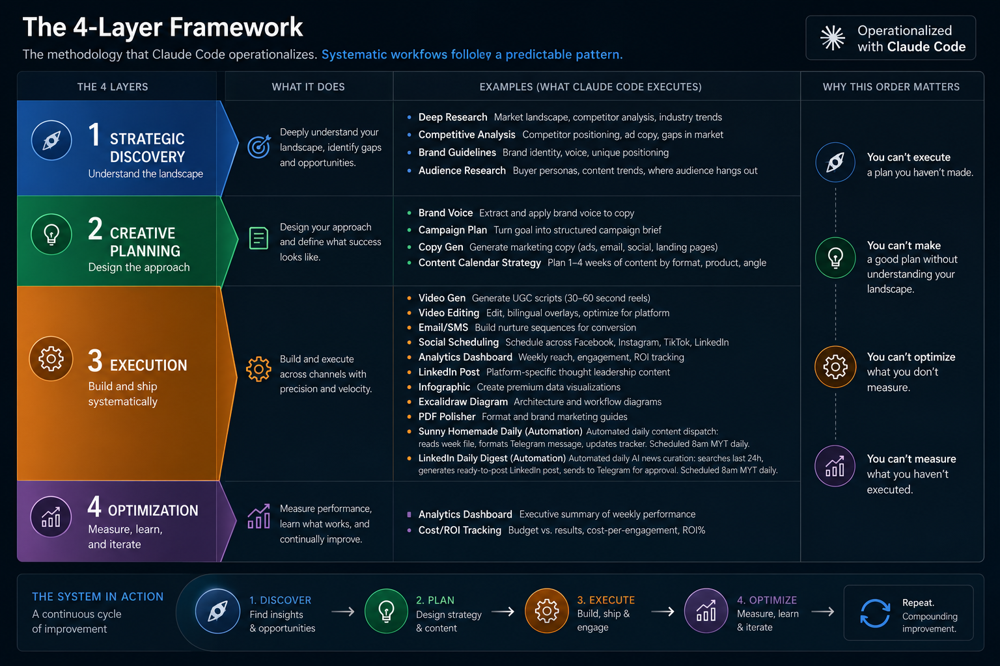

# Marketing-OS: Systematic Operations Framework

Choose your path:

**[🟢 New to Marketing-OS?](beginner/START-HERE.md)** (10-minute quickstart)  
Learn the SCEO framework, see real results from Sunny Homemade, get running fast.

**[🔴 Building Systems with Claude Code?](power-user/START-HERE-TECHNICAL.md)** (Technical deep dive)  
Understand the architecture, skill patterns, session discipline, and how to replicate this for any domain.

---

**What is this?**

A replicable 4-layer framework (SCEO: Strategic, Creative, Execution, Optimization) that brings systematic thinking to complex workflows, operationalized through Claude Code.

**Real results:** Sunny Homemade reduced weekly time from 5 hours to 2.5 hours while improving reach from 4.9K to 10K+ impressions.

The methodology applies to marketing, product, operations, or any domain requiring strategic planning, creative execution, and continuous optimization.
